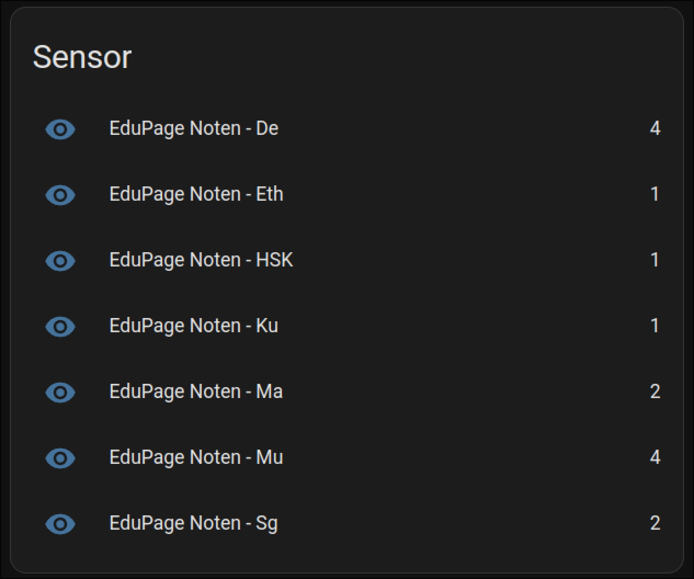
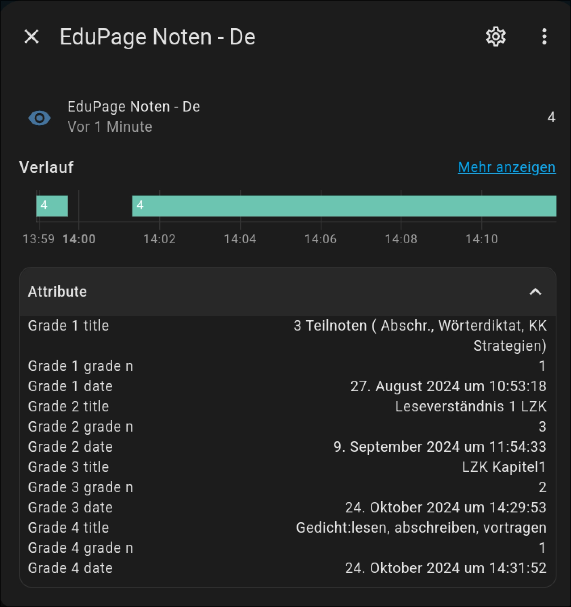

# homeassistant-edupage
An HomeAssistant integration of the EduPage Schooling System based on the edupage_api library found here https://github.com/EdupageAPI/edupage-api

## Installation
* Extract files in /custom_components/homeassistant-edupage to your installation.
* restart Home Assistant
* Add new integration and search for "Edupage"
* enter Username, Password and Subdomain (w/o ".edupage.org")
* based on your subjects you should find more or less sensors now, named bei the subject with grade-counts
* data is to be found as "attributes", see screenshot

